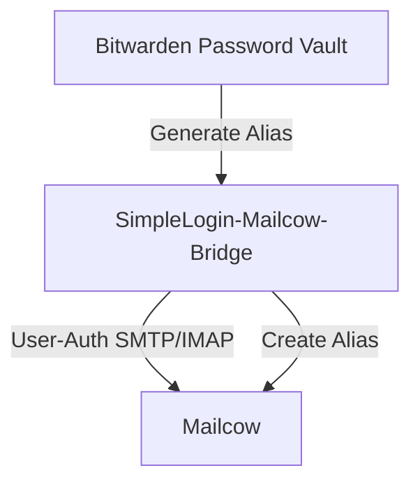

SimpleLogin-Mailcow Bridge
--

SimpleLogin API implementation for Bitwarden to generate email aliases in Mailcow

<br>

<!-- TOC -->
- [1. Overview](#1-overview)
    - [1.1. How It Works](#11-how-it-works)
    - [1.2. Features](#12-features)
- [2. Installation](#2-installation)
    - [2.1. Using Docker Compose](#21-using-docker-compose)
    - [2.2. From Source](#22-from-source)
- [3. Configuration](#3-configuration)
    - [3.1. Environment Variables](#31-environment-variables)
    - [3.2. Alias Templates](#32-alias-templates)
      - [3.2.1. Length Control](#321-length-control)
- [4. Usage](#4-usage)
    - [4.1. Setting up in Mailcow](#41-setting-up-in-mailcow)
    - [4.2. Setting Up in Bitwarden](#42-setting-up-in-bitwarden)
    - [4.3. Managing Aliases](#43-managing-aliases)
<!-- /TOC -->

<br>

# 1. Overview

This bridge service implements a SimpleLogin-compatible API that allows Bitwarden's email alias generation feature to communicate with a Mailcow email server. Generate random email aliases directly from your Bitwarden vault.

<br>

## 1.1. How It Works



<br>

## 1.2. Features

- Implements SimpleLogin-compatible API that works with Bitwarden
- Authenticates users with their existing Mailcow credentials
- Creates time-limited aliases in Mailcow (configurable validity period)
- Sophisticated template engine for alias generation with length control
- Support for SMTP and IMAP authentication methods (IMAP by default)

<br>

# 2. Installation

## 2.1. Using Docker Compose

### 2.1.1. Prerequisites

- A running [Mailcow](https://mailcow.email/) server
- [Docker](https://www.docker.com/) and [Docker Compose](https://docs.docker.com/compose/)
- Mailcow Admin API key

<br>

### 2.1.2. Setup

1. Use `docker-compose.yml` to set up the service:

2. Configure environment variables in docker-compose.yml:

Minimal example:
```yaml
  - MAILCOW_ADMIN_API_URL=https://mail.example.com/api
  - MAILCOW_ADMIN_API_KEY=your-mailcow-api-key
  - MAILCOW_SERVER_ADDRESS=mail.example.com:993  # For IMAP (default)
```

3. Run the service:
```bash
docker-compose up -d
```

<br>

## 2.2. From Source

### 2.2.1. Prerequisites

- Go 1.24 or higher
- Mailcow Admin API key

<br>

### 2.2.2. Building

1. Clone this repository:
```bash
git clone https://git.ruekov.eu/ruakij/simplelogin-mailcow-bridge.git
cd simplelogin-mailcow-bridge
```

2. Build the application:
```bash
go build -o simplelogin-mailcow-bridge
```

3. Set the required environment variables:
```bash
export MAILCOW_ADMIN_API_URL=https://mail.example.com/api
export MAILCOW_ADMIN_API_KEY=your-mailcow-api-key
export MAILCOW_SERVER_ADDRESS=mail.example.com:993  # For IMAP (default)
```

4. Run the application:
```bash
./simplelogin-mailcow-bridge
```

<br>

# 3. Configuration

## 3.1. Environment Variables

Variable | Description | Default
---------|------------|---------
`PORT` | Port to run the service on | 8080
`MAILCOW_ADMIN_API_URL`* | URL of your Mailcow Admin API | -
`MAILCOW_ADMIN_API_KEY`* | Mailcow Admin API key | -
`MAILCOW_AUTH_METHOD` | Method to authenticate users (SMTP or IMAP) | IMAP
`MAILCOW_SERVER_ADDRESS`* | Address to the Mailcow service used for auth (e.g. mail.example.com:993 for IMAP) | -
`ALIAS_VALIDITY_PERIOD` | How long aliases remain valid (in years) | 10
`ALIAS_GENERATION_PATTERN` | Pattern for generating aliases | `squirrel.fenneck@%s`
* Required

<br>

## 3.2. Alias Templates

The bridge supports a sophisticated template engine for generating aliases. You can use the following placeholders in your `ALIAS_GENERATION_PATTERN`:

Pattern | Description | Example Output
--------|------------|---------------
`{words}` | Random word or word combination | `brightocean`
`{words:N}` | N random words with separator | `royal.tiger.mountain`
`{word-chars}` | Alphanumeric string starting with a letter | `t5k7bs1q9p`
`{word-chars:N}` | Alphanumeric string of length N | `g8b2p5`
`{chars}` | String with letters, numbers, and special chars | `k4p-r2.n_b1`
`{chars:N}` | String with special chars of length N | `p3j_a8`
`{names}` | Random realistic-looking name | `Melito`
`{firstname}` | Random first name | `Kevan`
`{lastname}` | Random last name | `Tiros`
`{middlename}` | Random middle name | `Valen`
`{nickname}` | Random nickname | `Niko`
`%d` | Domain from user's email | `example.com`
`%s` | Legacy random string (10 chars) | `aghdkslfoq`

When using multiple name placeholders, they'll be coordinated to have a similar style.

### 3.2.1. Length Control

You can specify exact lengths or length ranges for most template variables:

Pattern | Description
--------|------------
`{word-chars:8}` | Exactly 8 characters
`{chars:6}` | Exactly 6 characters
`{firstname:5}` | First name of exactly 5 characters
`{firstname:4,8}` | First name between 4-8 characters
`{lastname:6,10}` | Last name between 6-10 characters
`{words:3}` | Exactly 3 words

Examples with length control:
- `{firstname:4}.{lastname:6}@%d` → `Trev.Nalior@example.com`
- `{word-chars:12}@%d` → `k7bsl5q3p9r2@example.com`
- `{firstname:5,8}_{chars:4}@%d` → `Kevan_b2p6@example.com`

Sensible defaults are applied if values aren't provided:
- Words: 1 word by default
- Word-chars and chars: 10 characters by default
- Names: between 3-10 characters by default

<br>

# 4. Usage

## 4.1. Setting up in Mailcow

Depending on your Authentication-method in mailcow, you might have to create an App-password.

1. Log into the mailcow-dashboard (should be your mailcow-domain)
2. **App passwords** > **Create app password**
3. Enter a name for the app password (e.g. `SimpleLogin Bridge`)
4. Set or generate a password
5. Add

## 4.2. Setting Up in Bitwarden

1. In Bitwarden, when creating a new login item, click the **Generate** button in the Username field: Then **Options** > **Type: Forwarded Email address** -> **SimpleLogin**
2. Set
    - **API Key**: Your Mailcow email address and password in the format `<email@domain.com>:<password>`
    - **Self-host server URL**: e.g. `http://your-bridge-address/`

<br>

### 4.2.1. Generating Aliases

1. When creating a new login in Bitwarden, click the **Generate** button in the username field
2. Click on the "Generate email" button at the top
3. A new random email alias will be generated and created in Mailcow

<br>

## 4.3. Managing Aliases

All generated aliases can be managed directly in your Mailcow user interface, where you can:
- View all active aliases
- Delete aliases you no longer need
