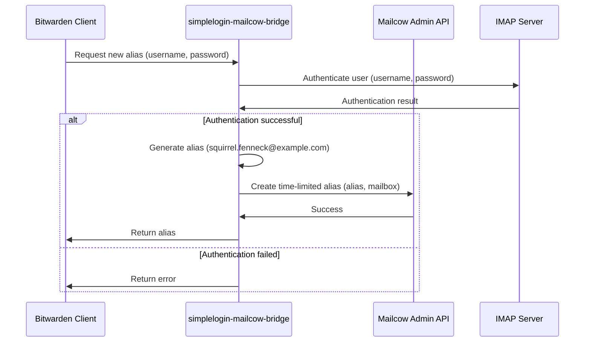

# simplelogin-mailcow-bridge Program Plan

## I. Program Overview

The `simplelogin-mailcow-bridge` program acts as an intermediary between Bitwarden and Mailcow, allowing users to generate and manage email aliases within Mailcow when creating new login entries in Bitwarden. The program exposes an API endpoint that Bitwarden can call to request a new email alias. The program then authenticates the user against Mailcow, generates a new alias based on the user's email domain, and creates a time-limited alias in Mailcow using the Mailcow Admin API.

## II. Program Architecture

## III. Components

1.  **API Endpoint:**
    *   Receives requests from Bitwarden for new email aliases.
    *   Authenticates users against Mailcow using their Mailcow credentials.
    *   Generates new email aliases based on the user's email domain.
    *   Creates time-limited aliases in Mailcow using the Mailcow Admin API.
    *   Returns the generated email alias to Bitwarden.
2.  **Authentication Module:**
    *   Authenticates users against Mailcow using IMAP, SMTP, CalDAV, CardDAV, or EAS.
    *   Caches successful authentication for a configurable period (e.g., 5 minutes) to avoid excessive requests to the Mailcow server.
3.  **Alias Generation Module:**
    *   Generates new email aliases based on the user's email domain.
    *   Allows configuring the alias generation pattern (e.g., `squirrel.fenneck@example.com`).
4.  **Mailcow Admin API Client:**
    *   Communicates with the Mailcow Admin API to create time-limited aliases.
    *   Uses a valid Mailcow Admin API token for authentication.
5.  **Configuration Module:**
    *   Reads configuration parameters from environment variables.
    *   Allows configuring the following parameters:
        *   Mailcow Admin API token
        *   Mailcow authentication method (IMAP, SMTP, CalDAV, CardDAV, or EAS)
        *   Mailcow server address
        *   Alias validity period (in years)
        *   Alias generation pattern

## IV. Authentication

1.  The user provides their Mailcow credentials (email address and password) to Bitwarden.
2.  Bitwarden sends a request to the `simplelogin-mailcow-bridge` API endpoint, including the user's Mailcow credentials.
3.  The `simplelogin-mailcow-bridge` program uses the Authentication Module to authenticate the user against Mailcow using the configured authentication method (e.g., IMAP).
4.  If authentication is successful, the program proceeds to generate a new email alias.
5.  If authentication fails, the program returns an error to Bitwarden.

## V. Alias Generation

1.  The Alias Generation Module generates a new email alias based on the user's email domain and the configured alias generation pattern.
2.  For example, if the user's email address is `user@example.com` and the alias generation pattern is `squirrel.fenneck@example.com`, the generated alias might be `squirrel.fenneck@example.com`.
3.  The generated alias should be unique and random to prevent collisions.

## VI. Mailcow Integration

1.  The Mailcow Admin API Client uses the Mailcow Admin API to create a time-limited alias in Mailcow.
2.  The alias is associated with the user's mailbox in Mailcow.
3.  The alias is valid for a configurable period (e.g., 10 years).
4.  The user can manage the alias through the Mailcow User UI.

## VII. Error Handling and Logging

1.  The program should handle errors gracefully and log them to a file or a logging service.
2.  The program should log all API requests, authentication attempts, alias generation events, and Mailcow API calls.
3.  The program should include appropriate error messages to help users troubleshoot issues.

## VIII. Testing

1.  The program should include unit tests to verify the functionality of individual components.
2.  The program should include integration tests to verify the interaction between components.
3.  The program should include end-to-end tests to verify the entire workflow, from Bitwarden to Mailcow.

## IX. Shipping and Deployment

1.  The program should be packaged as a Docker image.
2.  The program should be deployed using Docker Compose.
3.  The Docker Compose file should define the following services:
    *   `simplelogin-mailcow-bridge`
    *   `mailcow` (optional, for testing purposes)
4.  The Docker Compose file should allow configuring the program using environment variables.

## X. Documentation

The documentation should include the following:

1.  **README.md:**
    *   A general overview of the program.
    *   Instructions on how to build, test, and deploy the program.
    *   A description of the configuration parameters.
    *   Examples of how to use the program.
2.  **API Documentation:**
    *   A detailed description of the API endpoint that Bitwarden can call to request a new email alias.
    *   A description of the request and response formats.
    *   Examples of how to use the API endpoint.
3.  **Developer Documentation:**
    *   A description of the program's architecture and components.
    *   Instructions on how to contribute to the program.
    *   A description of the testing strategy.
